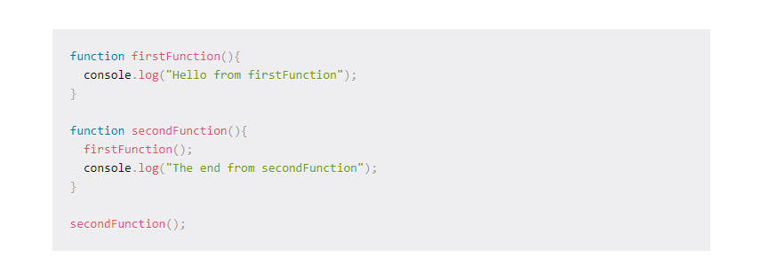
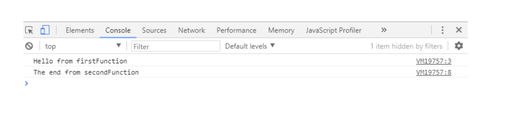

# Welcome to My Tenth reading notes for class10 in 301 level.
## Our First topic is **Understanding the JavaScript Call Stack**

## 1.	What is a ‘call’?
> function invocation
## 2.	How many ‘calls’ can happen at once?
>one at a time
## 3.	What does LIFO mean?
>It means that the last function that gets pushed into the stack is the first to be pop out, when the function returns.
## 4.	Draw an example of a call stack and the functions that would need to be invoked to generate that call stack.

## The result will be like this:

## 5.	What causes a Stack Overflow?
>when there is a recursive function (a function that calls itself) without an exit point.

## Our Second topic is **JavaScript error messages**

## 1.	What is a ‘refrence error’?
>When you try to use a variable that is not yet declared you get this type of errors.
## 2.	What is a ‘syntax error’?
>It’s typing the syntax wrongly
## 3.	What is a ‘range error’?
>Indicates an error when a value is not in the set or range of allowed values
## 4.	What is a ‘tyep error’?
>The types (number, string and so on) you are trying to use or access are incompatible, like accessing a property in an undefined type of variable.
## 5.	What is a breakpoint?
>It’s like managing you to see what has happened before that point and you can try and evaluate the next lines to check if everything is outputting what you are expecting.
## 6.	What does the word ‘debugger’ do in your code?
>It will act like a breakpoint
