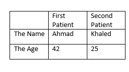

# Welcome to reading notes code 201 class 7:

## One of Our topics today is tables. And creating tables in HTML.
### How we can add tables ?
- We can use the **< table>** element to add tables to a web Page but first, you need to know how html deals with the table.
- It represented by rows, The contents of the table are written out row by row, so we use **< tr>** element –table row , and to specify the headlines of the table ,we use **< th>** element-table headline. 
- For the rest of the rows we use the **< td>**- table data.
- We can use the **scope** attribute on the <th> element to indicate whether it is a heading for a column or a row.
     >Example:

     > 

    > < table>
> < tr> 

> < th>< /th>

 > < th scope="col">First Patient< /th>

> < th scope="col">Second Patient< /th>

>< /tr>

>< tr>

>< th scope="row">The Name< /th>

>< td>Ahmad< /td>

>< td>Khaled < /td>

 >< /tr>

>< tr>

>< th scope="row">The Age < /th>

>< td>42< /td>

>< td>25< /td>

>< /tr>

>< /table>

## Now let’s move to a new topic about objects in Javascript.
- Actually it is not totally new as I have mentioned it in the previous reading notes, so we will continue to explain more about this topic.
- ### Let’s talk about CREATING OBJECTS USING CONSTRUCTOR SYNTAX.
- As I have mentioned before we had the first way of writing method using **Literal Notation**, today we have the second way which is the **Constructor Notation**.
- In constructor notation we use the *var* keyword then *object name* then = *new* keyword then *object()* function keyword, and then we start adding the properties and method we want.
- In order to access a property of this object, you can use *dot notation* or*square brackets*, just as you can with any object.
- Also, to use the method, you can use the *object name* followed by the *method name ()*.
- If you want to update a property we use the *object name* followed by the dot then the *property name* then = *the new value*.
- Each statement that creates a new property or method for this object ends in a semicolon (not a
Comma, which is used in the literal syntax).

### So, can we use the object we created once as a template for others-if they are similar- instead of keep writing objects?
- Yes, we can.
- **First**, we create our object template.
- We use it like *function* with *object name* and inside the *parentheses* we use parameters. Each one will sets the value of a property in the object.
- **Second** we use *var* keyword followed by *new object name* = *new* keyword followed by the *call to the function*.
- Here the new object will have the same method of the template object but the argument -which they are properties inside the object- will be different.

## Now, Have we seen before another type of objects ?
- Yes, the Answer is the **Arrays**.
- Arrays are special type of object, as it holds the**key/value pairs** but here the key for each value is its index number.
### Can we combine Arrays with objects? 
- Yes, as Arrays can store a series of objects also objects can holds arrays as a properties.

## What other types of objects we have ?
- We have the **Built-In objects** , that offer different range of tools that help you write scripts for webpages.
- We have three sets, the first set we have mentioned in the previous note DOM, here I will mention to you the other two sets.
- **The Browser Object Model**, which create a model of the browser window. 
- The BOM has many objects but the mainly used one is the *window object*, which represent the current browser window. 
- The last set is **The Global Javascript Objects** which represent a group of individual objects that relate to different parts of Javascript language and their names usually start with capital letter.
- Some of these objects represent data types:
  >For example:

  > We have **string** object to work with string values , some of its method called toLowerCase() which makes all the letters in the variable lower case .

   > username.toLowerCase ();

- We have another example of Global Javacript Objects is the *Date Object* which help in handling dates.
- We can use it as template and then we specify the date and the time we want it to represent.
- We use *var* keyword followed by *new object name* = *new* keyword followed by the *call to the function, Date object constructor*.
  >Example: 

  > var tomorrow = new Date(); here it will hold todays (or according to the computer clock) time and date.
